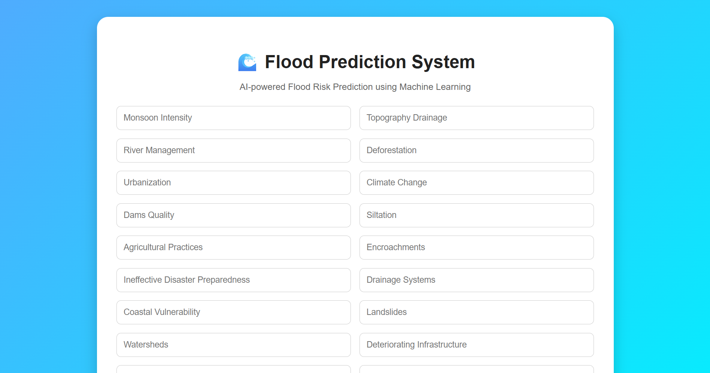
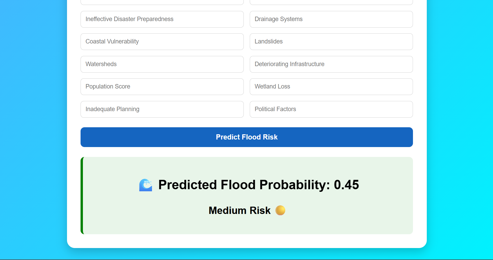
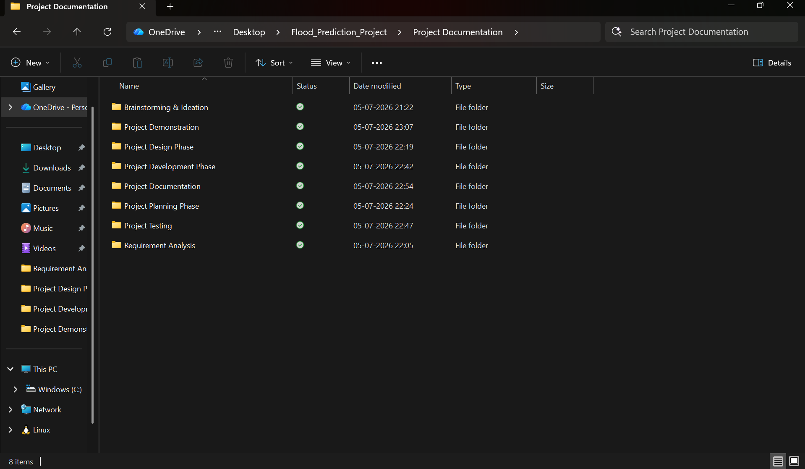

# 🌊 Rising Water – AI-Based Flood Prediction System

## Project Overview

Rising Water is a Machine Learning-based Flood Prediction System that predicts flood probability using environmental factors. It uses an XGBoost model with a Flask web application.

## Features

- Predicts flood probability
- Shows Low, Medium, or High Risk
- User-friendly web interface
- Machine Learning model integration
- Responsive design

## Technologies Used

- Python
- Flask
- Pandas
- NumPy
- Scikit-learn
- XGBoost
- HTML
- CSS
- Joblib

## Project Structure

```text
Flood_Prediction_Project/
├── app.py
├── README.md
├── requirements.txt
├── dataset/
├── models/
├── static/
├── templates/
└── Project Documentation/

## Screenshots

### Home Page


### Prediction Result


### VS Code


### Documentation
